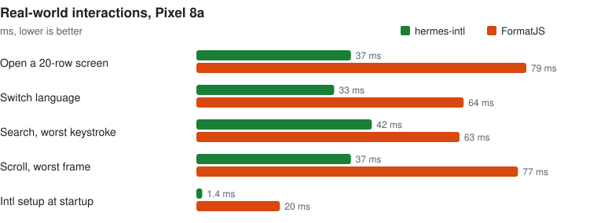
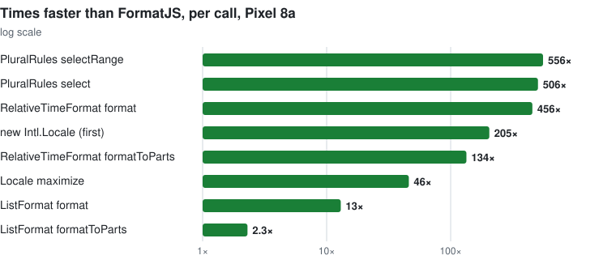

<a href="https://www.linkedin.com/in/jeremy-magrin/">
  
</a>

# hermes-intl

<a href="https://useffect.sh/seal/magrinj/hermes-intl"></a>

[](https://www.npmjs.com/package/hermes-intl)
[](LICENSE)

[](https://github.com/magrinj/hermes-intl/actions/workflows/ci.yml)


Native `Intl.PluralRules`, `Intl.RelativeTimeFormat`, `Intl.ListFormat` and `Intl.Locale` for
React Native's [Hermes](https://github.com/facebook/hermes) engine, backed by
[ICU4X](https://github.com/unicode-org/icu4x). A drop-in replacement for the
[FormatJS](https://formatjs.github.io/) polyfills.

## Why this library?

- **Fast.** `PluralRules.select` and `RelativeTimeFormat.format` are 200 to 800 times faster than
  the FormatJS polyfills.
  Screens that format dates and counts open about twice as fast, and the worst frame of a fast
  scroll is half as long.
- **Correct, and the same everywhere.** It passes test262 for these APIs (2 known failures) and gives
  byte-identical output on iOS and Android. FormatJS output depends on the platform, and its
  plurals for decimals are wrong in some languages.
- **Drop-in.** It installs the standard `Intl` constructors, so code and libraries that use them
  (i18next, react-intl, Luxon) pick it up without changes. The app ships ~400 KB less JavaScript
  and 1.0 to 1.7 MB more native code per ABI.

## Benchmarks

Pixel 8a, release builds of the same app with hermes-intl and with FormatJS ([example/](example/)):

<picture>
  <source media="(prefers-color-scheme: dark)" srcset=".github/assets/chart-interactions-dark.svg">
  
</picture>

<picture>
  <source media="(prefers-color-scheme: dark)" srcset=".github/assets/chart-speedup-dark.svg">
  
</picture>

Measured from the outside with [Flashlight](https://github.com/bamlab/flashlight), a fast scroll
scores **94/100 with hermes-intl and 62 with FormatJS**, which keeps the JS thread saturated for
3.6 of the 5 seconds.

The charts are from 2026-09-30. Timings move with the phone's state: a re-run the next day, with the
phone charging and cooler, sped up both builds and FormatJS more, for 200 to 385 times per call and
89 times on 10,000 notifications ([re-run](bench/README.md#re-run-on-2026-10-01)).

Every number, the other devices, conformance and how to reproduce: [bench/README.md](bench/README.md).

## Installation

```sh
npm install hermes-intl   # or: bun add hermes-intl / yarn add hermes-intl
cd ios && pod install
```

Import it on the first line of your entry file, before anything that uses `Intl`:

```js
// index.js
import 'hermes-intl';
```

Then remove `@formatjs/intl-pluralrules`, `intl-relativetimeformat`, `intl-listformat`,
`intl-locale` and `intl-getcanonicallocales` from your app.

**Requirements:** React Native 0.86+ with the New Architecture and Hermes (the default engine). Expo works with a
development build (`npx expo prebuild`), not Expo Go. Tested on React Native 0.87.1 and Expo SDK 57.

## Usage

Nothing to learn: it is the standard API.

```js
new Intl.PluralRules('pl').select(3); // "few"
new Intl.RelativeTimeFormat('fr', { numeric: 'auto' }).format(-1, 'day'); // "hier"
new Intl.ListFormat('en', { type: 'conjunction' }).format(['Anna', 'Omar', 'Yuki']); // "Anna, Omar, and Yuki"
new Intl.Locale('ar-EG').maximize().getWeekInfo(); // { firstDay: 6, weekend: [5, 6] }
```

With i18next, plurals just work:

```js
i18n.t('likes', { count: 3 }); // likes_few in Polish, likes_other in English
```

## What's included

| API | Notes |
| --- | --- |
| `Intl.PluralRules` | `select`, `selectRange`, `resolvedOptions`; all digit options, `notation` (incl. compact) |
| `Intl.RelativeTimeFormat` | `format`, `formatToParts`, `numeric: "auto"`, `-u-nu-` numbering systems |
| `Intl.ListFormat` | conjunction / disjunction / unit, long / short / narrow, `formatToParts` |
| `Intl.Locale` | all getters, `maximize`, `minimize`, and the Locale Info methods (`getWeekInfo`, `getTextInfo`, `getCalendars`, `getHourCycles`, `getNumberingSystems`, `getTimeZones`, `getCollations`) |
| `Intl.getCanonicalLocales` | replaced so it accepts `Intl.Locale` objects |
| `Intl.NumberFormat`, `DateTimeFormat`, `Collator`, `toLocaleString`, `localeCompare` | Hermes's own, wrapped so they accept an `Intl.Locale` object as the locale |

Each constructor is installed only if Hermes lacks it. On other engines (JSC, web) the import does
nothing. Conformance: 838 of 842 test262 `intl402` runs pass for these APIs (each test runs in
sloppy and strict mode). The 4 others are 2 known failures: a Hermes `NumberFormat` bug and a locale
outside the shipped set.

## Locales and size

The binaries include ICU4X's recommended set of 514 locales
([list](rust/locales/recommended.txt)). A locale outside the set falls back to its parent
(`fr-XX` → `fr`), then to the device locale, like any `Intl` implementation.

| Platform | Native size added |
| --- | --- |
| Android | 1.7 MB (arm64-v8a), 1.0 MB (armeabi-v7a), 1.7 MB (x86_64), 1.2 MB (x86) |
| iOS | 1.2 MB (arm64 device) |

To ship only your app's locales (about 0.6 MB per ABI for 5 locales), build the binaries yourself:
see [CONTRIBUTING.md](.github/CONTRIBUTING.md#custom-locale-set).

## Not included (yet)

- `Intl.NumberFormat` / `DateTimeFormat` replacements: Hermes's own are kept.
  Note that Hermes's `NumberFormat` lacks `formatToParts` on iOS and ignores `-u-nu-` there.
- `DisplayNames`, `Segmenter`, `DurationFormat`, `supportedValuesOf`.
- Worklet runtimes (Reanimated): install runs on the main JS runtime only.

## Differences from V8 worth knowing

- `new Intl.RelativeTimeFormat("en", { numeric: "auto" }).format(0.9999, "day")` is "in 1 day"
  (the spec: the value is not exactly 1); V8 rounds first and says "tomorrow".
- `getHourCycles()` and `getCalendars()` use compact CLDR tables; ICU4X ships no hour-cycle data.
- `getCollations()` returns the spec's fallback list, as no collation data is bundled.
- A single realm is assumed, as in React Native: subclassing across realms (`Reflect.construct`
  with a `newTarget` from another realm) uses this realm's prototypes.

## How it works

1. A C++ TurboModule (`cpp/`) exposes a few host functions over a Rust core (`rust/`) built on
   ICU4X, with locale data compiled in.
2. A small JS layer (`js/bootstrap.js`, bundled and precompiled to bytecode with your app) builds
   spec-exact constructors on top: prototypes, property descriptors, option reading order,
   validation, `formatToParts` objects.
3. Setup costs under 2 ms on a Pixel 8a; locale data is loaded on first use of each constructor.

[ARCHITECTURE.md](ARCHITECTURE.md) covers the design, how the library is injected at startup and
what a call goes through.

## Example app

[example/](example/) is the demo and benchmark app: a notification feed built twice, with
hermes-intl and with FormatJS, installable side by side, with an FPS meter and timed real-world
interactions.

## Contributing

See [CONTRIBUTING.md](.github/CONTRIBUTING.md).

## Acknowledgements

- [Hermes](https://github.com/facebook/hermes) and [React Native](https://reactnative.dev), by Meta
  and the open source community. hermes-intl only adds the `Intl` constructors Hermes does not ship;
  Hermes's own `NumberFormat`, `DateTimeFormat` and `Collator` stay in charge.
- [ICU4X](https://github.com/unicode-org/icu4x) and the Unicode CLDR, for the algorithms and the
  locale data.
- [test262](https://github.com/tc39/test262), the TC39 suite the implementation is checked against.
- [FormatJS](https://formatjs.github.io/), the polyfills used as the baseline in the benchmarks.

hermes-intl is an independent project, not affiliated with or endorsed by Meta or the Hermes team.

## Support

If you find this library useful, consider supporting its development:

<a href="https://buymeacoffee.com/magrinj" target="_blank">
  
</a>

## License

[MIT](LICENSE). Bundled ICU4X code and data are under the Unicode License v3; see
[THIRD_PARTY_NOTICES.md](THIRD_PARTY_NOTICES.md).

---

<p align="center">
  Made with ❤️ by <a href="https://www.linkedin.com/in/jeremy-magrin/">Jérémy Magrin</a>, part of <a href="https://useffect.sh">useffect.sh</a>, a collective of senior React Native engineers
</p>

<p align="center">
  If you find this useful, please star it ⭐, it helps a lot!
</p>
